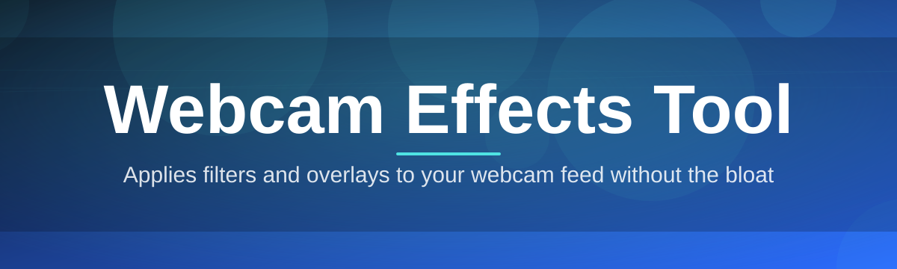
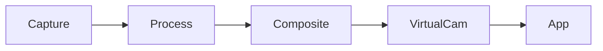

# webcam-effects-overlay 🎥✨

  

*A lightweight webcam overlay layer that turns any plain camera feed into something worth showing up on screen for.*

  

---

## 🌟 Overview

`webcam-effects-overlay` started as a weekend itch-scratch: every streaming and video-call setup out there felt bloated, subscription-gated, or tangled up in fifteen unrelated features nobody asked for. So this project takes the opposite approach — one focused job, done with care. It sits between your physical webcam and whatever app is consuming the feed (Zoom, Teams, OBS, Discord, browser calls), applying real-time visual overlays, color treatments, and framing effects without asking you to sign in, subscribe, or upload anything anywhere.

This is a **Webcam Effects Tool** in the truest sense — not a virtual-background gimmick bolted onto a bigger product, but a purpose-built utility for people who spend real hours in front of a camera: streamers, remote teams, educators recording lessons, and anyone tired of looking washed-out in a 9am call. It runs entirely on-device, processes frames locally, and outputs a clean virtual camera source that just works with the tools you already use.

Who is this for? Honestly — anyone who's ever thought "my webcam looks flat" and closed the laptop lid in mild despair. The tool is intentionally narrow in scope and wide in polish. No cloud processing, no telemetry, no accounts. Just a small, dependable Windows app that does one thing extremely well.

> [!NOTE]
> This project is maintained as a solo/small-team effort with enterprise-grade attention to stability. Releases are deliberate, not rushed.

---

## 🧰 What's Under the Hood

1. **Real-Time Color Grading** — Apply cinematic LUT-style color treatments to your live feed with near-zero latency, so your webcam stops looking like it was filmed through a fish tank.

2. **Smart Beauty & Skin Smoothing** — A subtle, adjustable smoothing pass that reduces harsh compression artifacts without turning your face into plastic — you control the intensity, not an algorithm guessing for you.

3. **Dynamic Background Overlays** — Layer static images, subtle motion graphics, or branded frames around your feed, ideal for consistent presentation across recurring meetings or streams.

4. **Auto Framing & Crop Assist** — Keeps your face centered as you shift in your chair, using lightweight local tracking — no cloud AI, no lag spikes.

5. **Lighting Correction Presets** — One-click exposure and white-balance correction profiles tuned for common lighting setups: ring light, window light, overhead office fluorescents, and "I forgot to turn on a lamp."

6. **Custom Overlay Text & Watermarks** — Add persistent name tags, social handles, or branding directly onto the output stream — handy for creators who stream across multiple platforms simultaneously.

7. **Scene Profiles** — Save entire effect combinations (color grade + overlay + framing) as named profiles, and swap between "Standup Meeting," "Stream Mode," and "Recording a Course" in one click.

8. **Virtual Camera Output** — Publishes a clean, standard virtual camera device that any conferencing or streaming app can select like a normal webcam — zero configuration required on the receiving end.

9. **Low-Latency Local Pipeline** — All processing happens on your machine, frame by frame, with no round-trip to a server — so your effects don't introduce the awkward audio-video drift video calls are famous for.

10. **Hotplug Device Handling** — Unplug your webcam mid-call, plug it back in, and the tool re-attaches automatically instead of leaving you staring at a frozen frame.

> [!TIP]
> Combine **Scene Profiles** with **Lighting Correction Presets** to build a one-click "morning standup" setup that adjusts automatically for your usual desk lighting.

---

## 🚀 Getting Started

1. Visit the project landing page (button above or below) and grab the latest Windows build.

2. Run the installer — no admin rights typically required, no bundled third-party software.

3. Launch `webcam-effects-overlay`, select your physical webcam as the input source.

4. Pick a Scene Profile or build your own, then select the new virtual camera inside Zoom, Teams, OBS, or your browser call — done.

> [!IMPORTANT]
> After installation, some conferencing apps cache their camera list. If the new virtual camera doesn't appear immediately, restart that specific app once before reporting an issue.

---

## 🖥️ System Requirements

| Component | Minimum | Recommended |
|---|---|---|
| OS | Windows 10 (64-bit) | Windows 11 |
| CPU | Dual-core 2.0GHz | Quad-core 3.0GHz+ |
| RAM | 4 GB | 8 GB+ |
| Webcam | Any UVC-compatible device | 1080p UVC webcam |
| Dependencies | None — fully standalone | None — fully standalone |

  

---

## ⚙️ How It Works

The pipeline is intentionally simple — a straight line from raw sensor data to polished output, with no detours through remote servers.

1. **Capture** — The physical webcam feed is read frame-by-frame through the standard UVC driver layer.

2. **Process** — Each frame passes through the active effects stack (color, smoothing, overlay, framing) in a fixed, predictable order.

3. **Composite** — Overlay graphics and text layers are merged onto the processed frame.

4. **Publish** — The final frame is pushed to a virtual camera device that other apps can select.

> [!NOTE]
> Because every stage runs locally and synchronously, there's no buffering delay large enough to cause noticeable lip-sync drift in typical use.

---

## 🩹 Troubleshooting

<strong>My virtual camera doesn't show up in Zoom/Teams.</strong>

Restart the conferencing app after launching `webcam-effects-overlay`. Most apps enumerate camera devices only on startup.

<strong>The overlay looks delayed compared to my actual movement.</strong>

Lower the smoothing intensity or disable framing assist — heavier effect stacks on older CPUs can introduce a frame or two of processing delay.

<strong>Colors look washed out after enabling a Lighting Correction preset.</strong>

Presets are tuned for average lighting conditions. Nudge the manual exposure slider afterward — presets are a starting point, not a final answer.

<strong>My webcam disconnected during a call and the feed froze.</strong>

Hotplug handling should re-attach automatically within a few seconds. If it doesn't, reselect the input device from the source dropdown manually.

<strong>Can I run this alongside OBS scenes?</strong>

Yes — select the published virtual camera as a source inside OBS just like any physical device.

> [!WARNING]
> Running two instances of the tool simultaneously against the same physical webcam can cause device lock conflicts. Close one instance before opening another.

---

## 🎨 UI / UX Details

- **Themes** — Light, Dark, and a low-glare "Night Call" theme for late-evening sessions.

- **Keyboard Shortcuts**

  | Action | Shortcut |
  |---|---|
  | Toggle overlay on/off | `Ctrl + Shift + O` |
  | Cycle Scene Profiles | `Ctrl + Tab` |
  | Open Settings | `Ctrl + ,` |
  | Reset to defaults | `Ctrl + Shift + R` |

- **Settings Persistence** — All profiles, presets, and last-used device selections are saved locally between sessions.

- **Compact Mode** — A minimized floating control bar for streamers who want quick access without a full window on screen.

---

## 🤝 Contributing & Community

This project grew out of a genuine weekend build, and it stays alive because of people who care enough to file good bug reports, suggest sane feature ideas, and occasionally submit a clean pull request.

> [!TIP]
> Before opening an issue, check the Troubleshooting section above — a good chunk of reports turn out to be app-specific camera caching behavior, not the tool itself.

- Open an issue for bugs, with your Windows version and webcam model included.

- Propose features via discussion first — this keeps the tool focused rather than feature-bloated.

- Pull requests are welcome; smaller, focused diffs get reviewed faster than sprawling ones.

---

## 📄 License

Released under the [MIT License](LICENSE), 2026.

---

## ⚠️ Disclaimer

`webcam-effects-overlay` is provided as-is, for legitimate personal and professional use in video calls, streaming, and recording. It does not collect, transmit, or store any video data off your device. Use of this tool during calls or broadcasts remains subject to the policies of the platform you're using it with.

---

